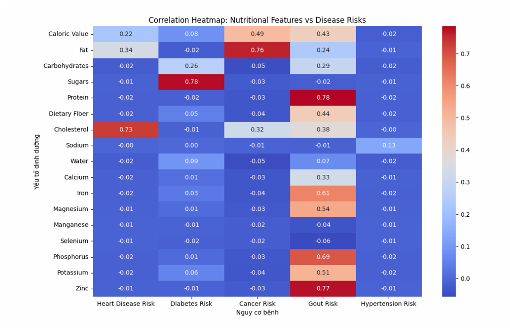
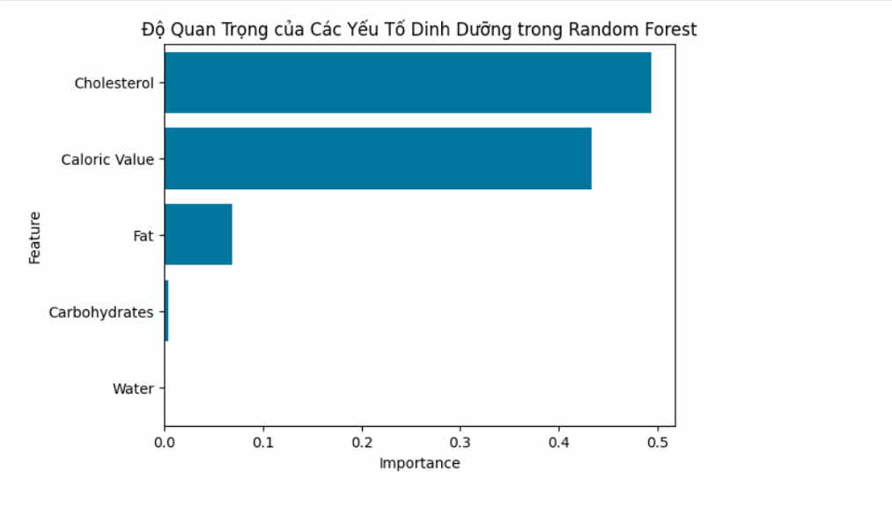
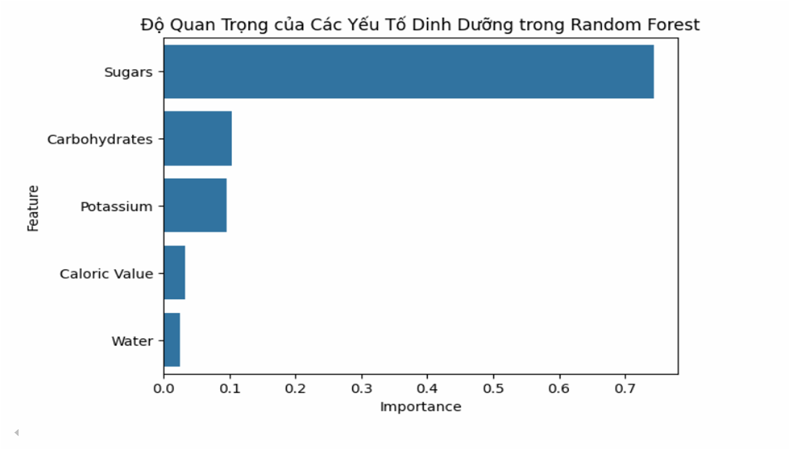
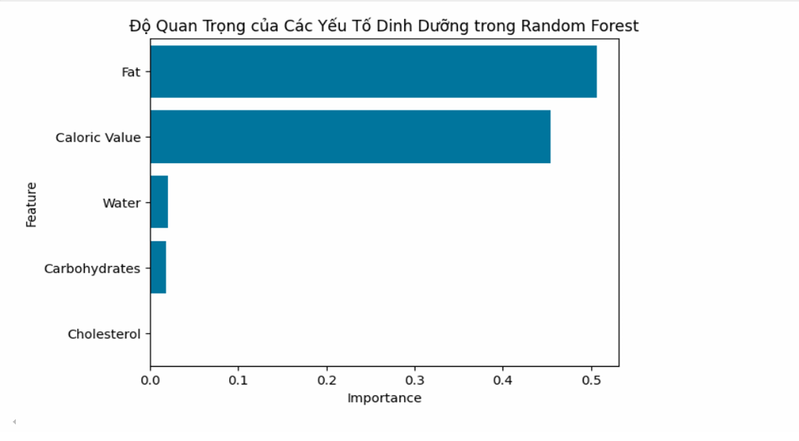
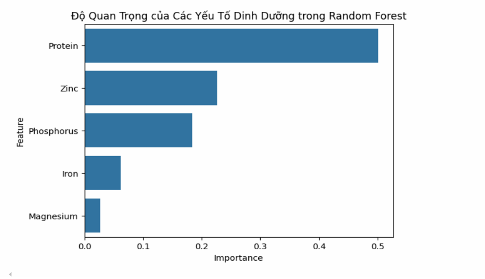

# 🍎 Dự Đoán Nguy Cơ Mắc Bệnh Mãn Tính Dựa Trên Dữ Liệu Dinh Dưỡng - OCE

## 📝 Giới thiệu

Đây là đồ án phân tích dữ liệu nhằm dự đoán nguy cơ mắc **các bệnh mãn tính** như:

- 💓 Bệnh tim mạch  
- 🍬 Tiểu đường  
- 🧬 Ung thư  
- 🦵 Gút (Gout)  

Dựa vào thành phần dinh dưỡng của thực phẩm, nhóm đã xây dựng mô hình dự đoán sử dụng các thuật toán **Decision Tree** và **Random Forest** để đánh giá nguy cơ mắc bệnh.

---

## 🎯 Mục tiêu

- 📌 Thu thập và phân tích dữ liệu dinh dưỡng từ các thực phẩm phổ biến.
- 📌 Xác định mối liên hệ giữa các thành phần (cholesterol, fat, sugars...) và bệnh lý.
- 📌 Ứng dụng học máy để dự đoán nguy cơ mắc bệnh.
- 📌 Đề xuất chế độ ăn uống lành mạnh để phòng tránh các bệnh mãn tính.

---

## 📦 Dữ liệu

- **Tên file:** `FOOD-DATA.csv`
- **Số thuộc tính:** 23 (Caloric Value, Fat, Sugars, Protein, Zinc, ...)
- **Xử lý dữ liệu gồm:**
  - ✅ Loại bỏ cột không cần thiết (`Unnamed`)
  - ✅ Chuẩn hóa dữ liệu bằng Min-Max Scaling
  - ✅ Trích xuất đặc trưng bằng SelectKBest (ANOVA F-test)

---

## ⚙️ Mô hình & Công cụ

- **Ngôn ngữ:** Python 3.10+
- **Thư viện sử dụng:**
  - `pandas`, `numpy`, `matplotlib`, `scikit-learn`, `seaborn`
- **Thuật toán:**
  - `DecisionTreeClassifier`
  - `RandomForestClassifier`
- **Chỉ số đánh giá:**
  - 🎯 Accuracy (Độ chính xác)
  - 🧪 Sensitivity (Độ nhạy)
  - 🛡 Specificity (Độ đặc hiệu)

---

## 💻 Hướng Dẫn Cài Đặt & Chạy

### 1. Clone project:
```bash
git clone https://github.com/ten-ban/OCE-Food-Prediction.git
cd OCE-Food-Prediction
````

### 2. Cài thư viện:

```bash
pip install -r requirements.txt
```

### 3. Chạy code:

* Jupyter Notebook: `notebooks/*.ipynb`
* Python script (nếu có): `src/*.py`

---

## 📊 Kết Quả Mô Hình

| 🩺 Bệnh    | ⚙️ Mô hình    | 🎯 Accuracy | 🔍 Sensitivity | 🛡 Specificity |
| ---------- | ------------- | ----------- | -------------- | --------------   |
| Tim mạch   | Decision Tree | 80%         | 80%            | 85%              |
|            | Random Forest | 95%         | 85%            | 95%              |
| Tiểu đường | Decision Tree | 85%         | 86%            | 90%              |
|            | Random Forest | 95%         | 85%            | 98%              |
| Ung thư    | Decision Tree | 88%         | 89%            | 92%              |
|            | Random Forest | 90%         | 89%            | 98%              |
| Gút        | Decision Tree | 85%         | 80%            | 91%              |
|            | Random Forest | 95%         | 87%            | 94%              |

---

## 🖼️ Trực Quan Dữ Liệu

### 🔥 Heatmap Tương Quan



> Biểu đồ cho thấy mối tương quan mạnh giữa:
>
> * **Cholesterol** và nguy cơ **tim mạch**
> * **Sugars** và **tiểu đường**
> * **Fat** và **ung thư**
> * **Protein** và **gout**

---

### 🌟 Feature Importance

#### 💓 Tim mạch



#### 🍬 Tiểu đường



#### 🧬 Ung thư



#### 🦵 Gút (Gout)



---

## 📚 Tài Liệu Tham Khảo

* [WHO - Diabetes](https://www.who.int/news-room/fact-sheets/detail/diabetes)
* [Kaggle - Food Nutrition Dataset](https://www.kaggle.com/code/surajthakur21/food-nutrition-dataset)
* [Decision Trees in Medicine (ResearchGate)](https://www.researchgate.net/publication/11205595_Decision_Trees_An_Overview_and_Their_Use_in_Medicine)

---


